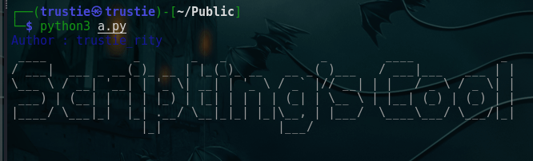

# Tools
This a repository for tools i  will make to help in playing capture the flag challenges.
There is also a category for learning most common ctf categories . And since am a binary lover i have most of pwn and reverse Engineering here :)
 
#### First Tool
 - Grafana password bruteforcer tool written in go.
 - Zip files password brute forcer written in python3.
 - <a href="/zip" >zip tool :)<a/>
 - <a href="/Grafana_password_bruteforcer">grafana password bruteforcer :)<a/>

* [x] Enjoy :) 

* [x] Give me stars :)
