# LibcorHeap1

## Setup
- So to play around with this challenge,Just clone the repo ..then you can run it on a Vm or locally if you're on  linux.
- Else you can use the Dockerfile to set up a Docker instance ...
- It will be set up on port 1024
- So you can connect using nc Example: ``` nc 127.0.0.1 1024 ```
- The libc.py file is my exploit for the challenge
- To compile the binary: ``` gcc -no-pie -o chall firstchallenge.c```

## PWN(Binary Exploitation)
#### Synopsis
- This is a binary exploitation challenge that allows one to exploit a bug made by the programmer to gain access to the server by out popping a shell.
- Skills Required
 * Basic linux knowledge
 * Basic programming skills
 * Debugging techniques
- Enumeration
- First as we all don't really love assembly, let us use the source code.
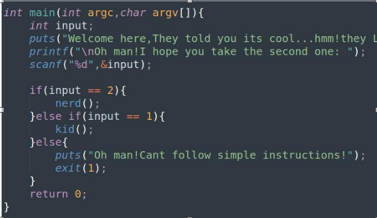

- The main function is pretty simple. We can see it welcomes us with a banner then proceeds to test our input and it will jump to various functions based on our choice.
- If we don't choose between 1 and 2 it sends an exit signal to the kernel so we never return .Let's explore the two functions :
`` nerd(): ``
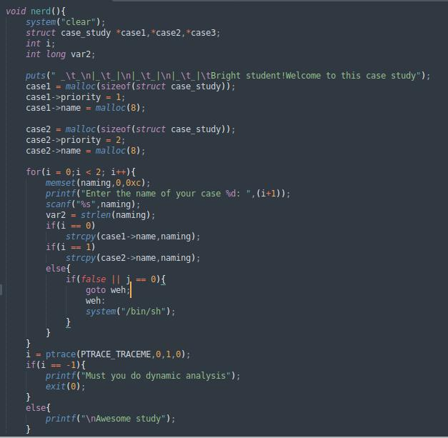
- We start by declaring 3 struct objects from this struct case_study skeleton:

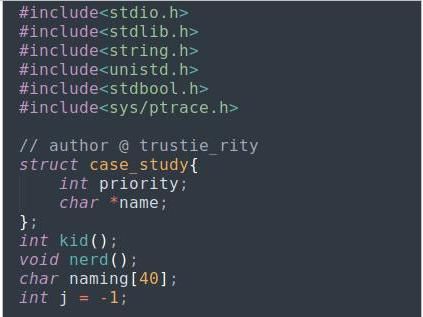

- It has 2 members, a priority int type and string to be stored in a name which is a pointer.
- We allocate memory on the heap for the first two struct objects. Then we go ahead to use strcpy which is a dangerous function as it wont check the size of our input .Hmm! First bug. After that there is a dead code which will never be reached. There’s a Ptrace check to see if one is using a debugger and it just prints out some text.

- Hmm can we really use this bug to our advantage? No we cant .Its a heap overflow so we can overwrite the address of second name pointer with puts got address and with the second strcp() function copy system address to the got of puts,so when we will be printing some data it will call system but now system requires one argument which in our case should be /bin/sh .How will we get rdi register to contain address of bin/sh  at that time . At this moment you realize this is a rabbit whole!Let's look at the next function .
- As a hint : to see that dead code in ghidra you must enable show dicompilation of unreachable code in the Edit option.
Kid()
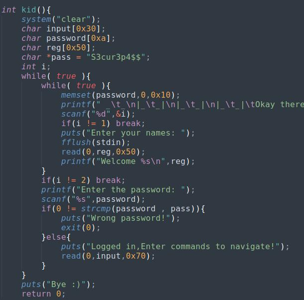
- In this function we get a hard coded password and a while loop.Unless we provide invalid input we will never get out of the loop . Looking carefully we see the read function is reading a larger input than the one allocated for input .This is the bug.

#### Gaining Foothold
- So first we give excess input then give the program an invalid input to break out of the loops.Boom you get a segmentation fault.
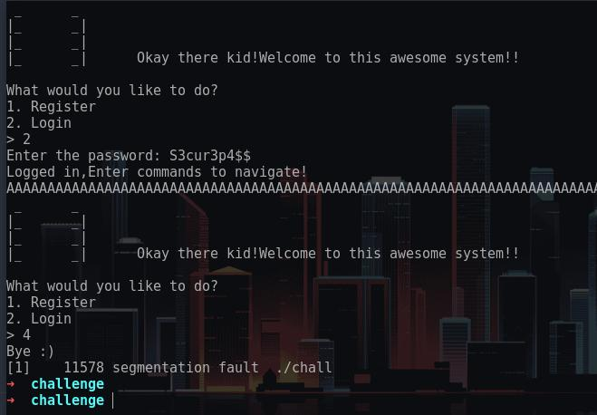
- First things first let's get the offset to get to the return value .
`` pwn  cyclic 100``
- So that is to get a pattern of 100 characters.
`` aaaabaaacaaadaaaeaaafaaagaaahaaaiaaajaaakaaalaaamaaanaaaoaaapaaaqaaaraaasaaataaauaaavaaawaaaxaaayaaa``
- So let's overflow the program .Before that we run in gdb and set a breakpoint at the return value of kid function .
``gdb  chall -q
set  disassembly-flavor intel
disass kid
-q is for launching gdb in quiet mode. Then we set the assembly syntax to intel .``
- After that we disassemble the kid function .

- We are set to run the binary now .
``r ``
- Use r to run the binary ,it is shorthand for run . Enter the input accordingly ie 1 , 2 , then password ,cyclic pattern followed by invalid option to break out of the loop as shown below:
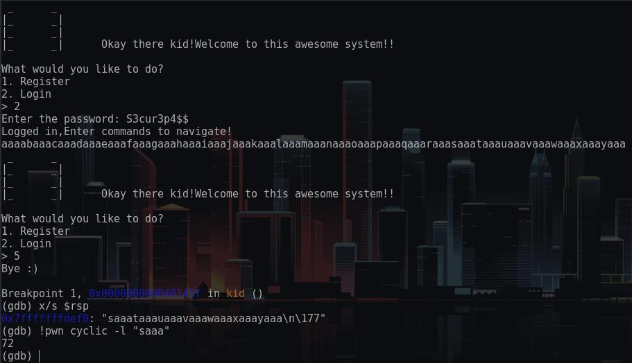
- So using the above commands we get the offset is 72.
- What can we do now? Use shellcode …. Lets see
<img src"./nx.jpeg" /.
- NX (not executable stack) is enabled so no shellcode here , i mean using that will be a long way ,lets see ..We need to use mprotect () function to make the stack executable then insert shellcode ,After that we find address of start of shellcode …
-Hmm , we are in a hurry. Let's just use libc .
- We need to leak a libc address ,use that to calculate the base address of libc, we can do that pretty easy , call address of puts at plt which will resolve the actual address of puts and store it in puts Got(global offset table) and since puts requires one argument we store the put@got address in the rdi register. 
- Sounds like  a plan. For that lets just write a script :
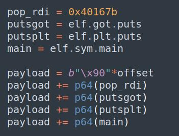
- We got that pop rdi gadget address using ropper and since Pie is disabled it doesn't change. Using this we get a leak of the puts function .
- We subtract that from the base address at that time of execution since the offsets don't change. We can use it to calculate the base address  of libc everytime we run the binary, simply by subtracting the offset from the puts leak.!
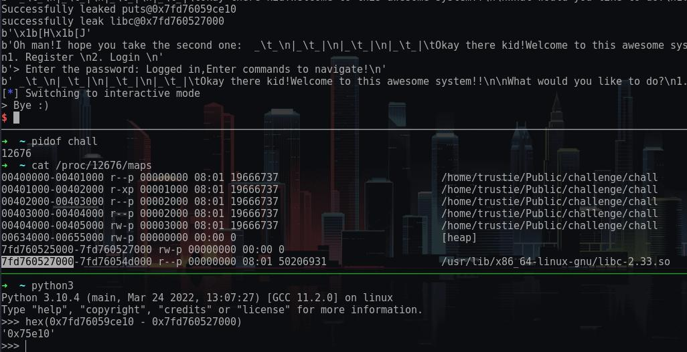
- From here we can call main again and repeat that same procedure but now we will be calling system function with bin/sh as its argument. You thought right! We will get a shell now.
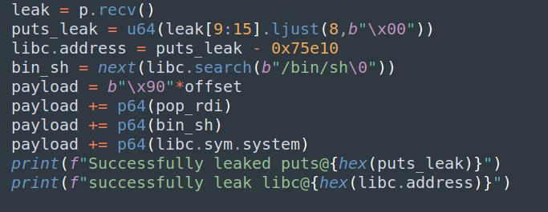
- So putting our exploit together into a script ..we get a shell
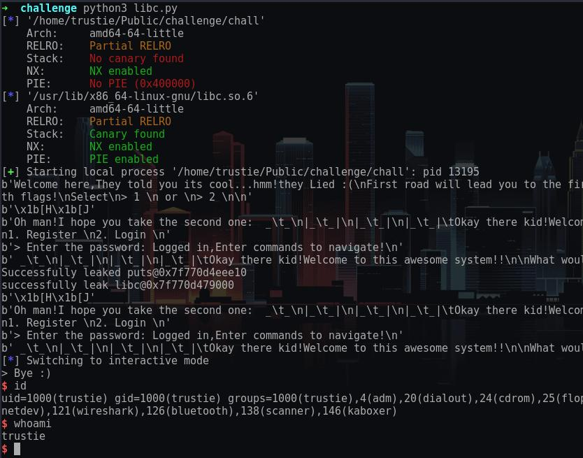
### Proving nerd was a rabbit whole
- Lets fire up gdb and set breakpoint at the first malloc,then right after the each strcpy function.
- Run the binary and when we hit the first break point get the value in the rax register. All return values from functions are handled via rax register and in our case the return value is an address on the newly allocated memory on the heap that is returned by malloc() function.
- Define a hook stop which will be executed every time we hit a breakpoint, For the case names ,first name use 40 As. I already know the offset that is why I am specifically pointing out that value . Then use c to continue execution .

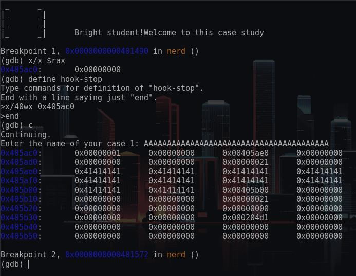
- We can see we overflowed and we were just about to overwrite the address of the second pointer name that points to where the second name will be stored. The second priority value is overflowed with As.
- Lets hit continue and enter Second name as a couple of Bs.

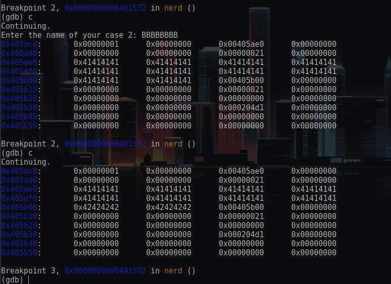 
- As you can see the Bs are copied to that address.This would have been a very sweet way to jump to a function win but we don't have a kind of that function in this binary! 


## Enjoy
- Enjoy :)  
