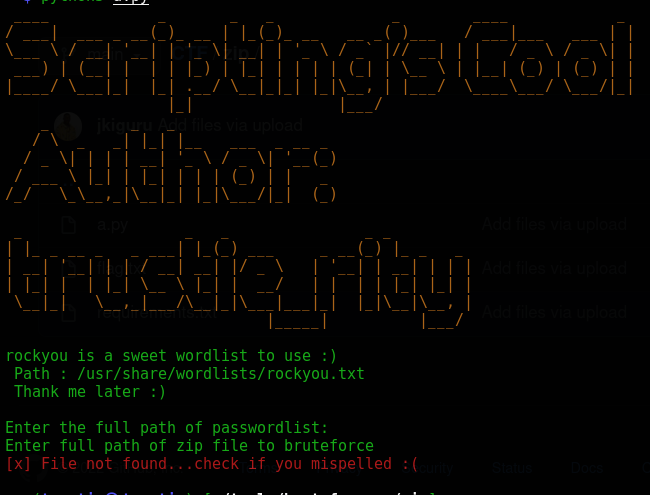

# Zipfiles password bruteforcer Tool
-  use the requirements.txt to install requirements .
-  Note its a linux Tool!
``` pip3 install -r requirements ```
- Run it using python3 [scriptname].py . Alternatively add executable bits to it ``` chmod +x [scriptname].py``` and execute it as ```./[scriptname].py```


